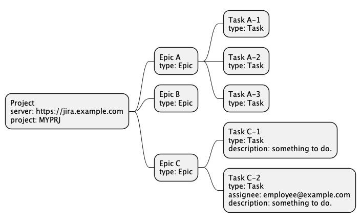
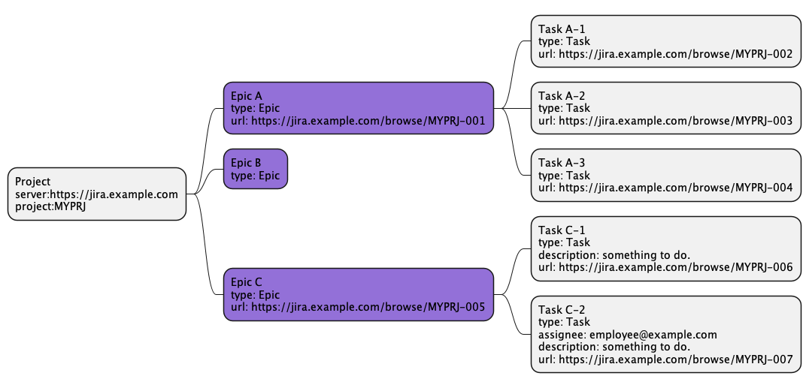
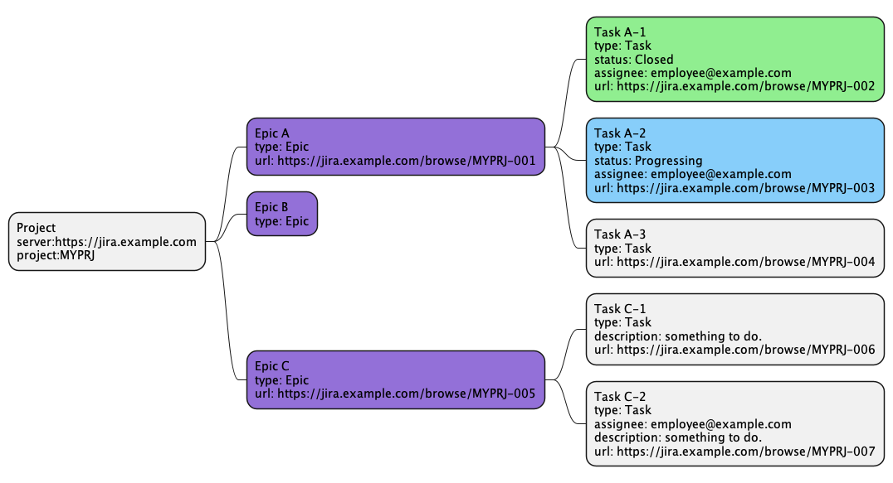

# goshinboku

goshinboku is a task management tool. 
You can create jira tasks using a logic tree and synchronize them with a server status.

## Example
You can write a logic tree to create jira tasks like this.

goshinboku make tasks and overwrite the logic tree.

goshinboku can update the logic tree.

